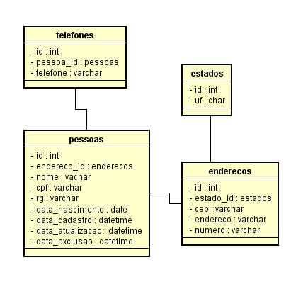

Esse projeto é um CRUD que implementa a estrutura de banco de dados abaixo e também possui a funcionalidade de autenticação de usuário (é armazenado o e-mail e a hash da senha).

  

 

## Tecnologias utilizadas

- Docker
- PHP v8.2
- Banco de Dados: MySQL
- HTML/CSS
- Javascript
- JQuery
- Bootstrap
- Arquitetura MVC

## Como testar em sua máquina

- Para baixar as dependências do projeto, execute o comando `composer install`
- Execute o comando a seguir para subir os containers `docker compose up -d`
- Assim que subir os containers, será criado o banco de dados `crud-php`. Agora acesse o container do phpmyadmin e utilize o arquivo `scripts.sql` na raíz do projeto para criar as tabelas. 
- Entre na URL `http://localhost:8000`
